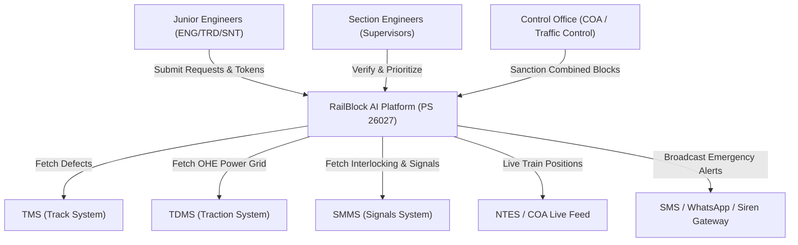
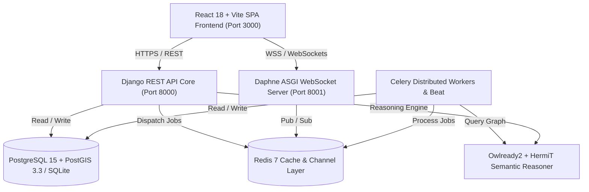

# 00-architecture.md
<!-- Indian Railways AI Automatic Block Planning Platform (PS 26027) -->
> **ফাইল ক্রম:** ১/৪৫  
> **পরবর্তী ফাইল:** `00-master-high-level/01-decision-log.md`  
> **সংযোগ:** এই ফাইলে বর্ণিত Tech Stack, Architecture Pattern, এবং Master Plan-এর ১২২টি ফিচারের আর্কিটেকচারাল ডিসিশনসমূহ `01-decision-log.md`-এ লগ করা আছে।

---

## 1. Project Master Identity & PS 26027 Alignment

| বিষয় / Parameter | বিবরণ / Master Value |
|:---|:---|
| **Problem Statement ID** | **PS 26027** (Smart India Hackathon) |
| **Project Title** | **AI-Powered Automatic Block Planning to Maximize Asset Availability for Train Operations on Indian Railways** |
| **Organization** | **Ministry of Railways** — Category: Software, Theme: Transportation & Logistics |
| **Core Pain Point** | Engineering (TMS), TRD (TDMS), এবং S&T (SMMS) বিভাগসমূহ বর্তমানে স্বতন্ত্রভাবে ম্যানুয়াল পদ্ধতিতে BDMS-এর মাধ্যমে মেইনটেনেন্স ব্লক প্ল্যান করে। এই বিকেন্দ্রীভূত ও ম্যানুয়াল পদ্ধতির কারণে অকার্যকর ব্লক শিডিউলিং, সমন্বয়হীনতা, ট্রেনের অনাকাঙ্ক্ষিত বিলম্ব এবং ট্র্যাক অ্যাসেটের প্রাপ্যতা (availability) ব্যাহত হয়। |
| **Primary Value Proposition** | তিন ডিপার্টমেন্টের ডেটা একত্রিত করে একক ইউনিফাইড প্ল্যাটফর্ম তৈরি করা, যার মাধ্যমে **⭐ Combined Block Window (USP)** পদ্ধতিতে যৌথ ব্লক কার্যকর করা যায়, সুইপ-লাইন অ্যালগরিদমে রিয়েল-টাইম কনফ্লিক্ট নিরসন হয় এবং Semantic Digital Twin-এর মাধ্যমে ট্রাফিক ও ওএইচই সেকশনের আন্তঃসম্পর্ক পর্যালোচনা করা যায়। |
| **Primary Success Metrics** | ১. **Asset Availability Score (#50)** বৃদ্ধি<br>২. **Variance % (#109)** সর্বনিম্ন রাখা<br>৩. **Auto-resolved Conflicts (#31/#32)** ম্যাক্সিমাইজ করা |
| **Target Users** | Section Engineers (ENG/TRD/SNT), Junior Engineers, Control Office Administrators (COA), Traffic Controllers, এবং On-field Maintenance Gangs |
| **Expected Scale** | Hackathon MVP (North Central / Eastern Railway Corridor — যেমন: NDLS-GZB-ALJN এবং Howrah-Kharagpur), পরবর্তীতে All-India IR Network |

---

## 2. PS 26027 Core Architecture Pillars (From Master Plan)

### 📌 Point 1 — Multi-Departmental Data Integration
- **Legacy Systems Integrated**: Track Management System (**TMS**), Signal Maintenance & Management System (**SMMS**), Traction Distribution Management System (**TDMS**), Control Office Application (**COA**), Block Data Management System (**BDMS**), National Train Enquiry System (**NTES**).
- **Core Capabilities**:
  - লাইভ কন্ট্রোল অফিস ফিড ও এনটিইএস ইন্টিগ্রেশন (#42, #48)
  - ইটিএল সিঙ্ক শিডিউলার (#68) এবং অফলাইন ফাইল-ভিত্তিক ফলব্যাক (#88)
  - ইউনিফাইড অ্যাসেট রেজিস্ট্রি (#86) ও প্রমিত চেইনেজ নরমালাইজেশন (#87)
  - ডেটা ফ্রেশনেস মনিটর (#89) এবং মাল্টিপল ডিফেক্ট মার্জার (#90)
  - গুডস ও ফ্রেট ট্রেনের ফোরকাস্ট এন্ট্রি গেটওয়ে (#91)
  - অটো ব্লক রিকোয়েস্ট জেনারেটর (#2) ও হিস্টোরিক্যাল লগ অ্যানালিটিক্স (#13)

### 📌 Point 2 — AI-Driven Prioritization Engine
- **Core Engine**:
  - স্মার্ট কিউ ম্যানেজমেন্ট (#34)
  - $CoF \times LoF$ মাল্টি-ফ্যাক্টর রিস্ক ম্যাট্রিক্স (#92)
  - ডিফেক্ট এজিং স্কোর ক্যালকুলেটর (#93)
  - **"Why #1?"** এক্সপ্লেনেবল এআই (XAI) ডিসিশন কার্ড (#94)
  - প্যাসেঞ্জার ও ফ্রেট ট্রেন প্রায়োরিটি ক্লাসিফায়ার (#24, #27)
  - ক্রিটিক্যাল করিডোর ওয়েটিং (#97)
  - প্রেডিক্টিভ মেইনটেনেন্স শিডিউলার (#33) ও ডাউনটাইম প্রেডিক্টর (#36)
  - সিজনাল প্যাটার্ন অ্যানালাইজার (#35) ও ডেফার্ড টাস্ক এসকেলেশন (#95)

### 📌 Point 3 — Optimization & Multi-Department Coordination
- **Platform USP**: **⭐ Combined Block Window Optimization (#98)** — একই করিডোর ও ট্র্যাক সেকশনে একাধিক বিভাগের জন্য একীভূত কম্বাইন্ড ব্লক শিডিউল তৈরি করা।
- **Scheduling & Conflict Engine**:
  - সুইপ-লাইন এআই কনফ্লিক্ট ডিটেকশন (#31) ও অটোম্যাটিক রেজোলিউশন (#32)
  - টাস্ক ডিপেনডেন্সি ডিরেক্টেড অ্যাসাইক্লিক গ্রাফ (DAG) (#99)
  - ব্লক ডিউরেশন অপ্টিমাইজার (#5) ও স্প্লিট ব্লক শিডিউলিং (#6)
  - ওয়ার্কলোড ব্যালেন্সিং (#37) ও মেগা ব্লক প্ল্যানার (#102)
  - গ্যাং হোম-বেস রাউটিং (#100) ও মেটেরিয়াল ডেলিভারি টাইম-স্লট (#101)
  - ক্যান্সেলড উইন্ডো ব্যাকফিলিং (#103) ও নাইট ব্লক অগ্রাধিকার (#8)
  - পিক আওয়ার প্রোটেকশন (#29) ও ফ্রেট করিডোর অপ্টিমাইজেশন (#28)
  - ফাস্ট ট্র্যাক ক্লিয়ারেন্স (#25) ও মিনিমাম সেফ ওয়ার্ক উইন্ডো গার্ড (#70)
  - রিয়েল-টাইম ব্লক মনিটর (#3) ও ডিসরাপশন-পরবর্তী অটো রি-প্ল্যানার (#108)

### 📌 Point 4 — Multi-Horizon Planning & Sanction Governance
- উইকলি ও মান্থলি রোলিং মাস্টার প্ল্যান জেনারেটর (#61)
- প্ল্যান ফ্রিজ উইন্ডো এনফোর্সমেন্ট (#105) ও ভার্সনিং (#106)
- ডিজিটাল স্যাংশন অর্ডার পিডিএফ জেনারেটর উইথ কিউআর ভেরিফিকেশন (#107)
- মাল্টি-লেভেল অ্যাপ্রুভাল ওয়ার্কফ্লো (JE → SE → Sr.DEN → COA) (#11) ও এসএলএ ট্র্যাকার (#63)
- স্বয়ংক্রিয় কমপ্লায়েন্স ও পারফরম্যান্স রিপোর্ট (#53)
- ভ্যারিয়েন্স অটো-অ্যানালাইসিস ইঞ্জিন (#109)

### 🚆 Train Schedule Awareness & Disruption Cascade
- দূরপাল্লার এক্সপ্রেস ট্রেনসমূহের ১+ মাস পূর্বের সময়সূচি ডাটাবেজ: **Train Time Table Master (#114)**
- লাইভ এনটিইএস ট্র্যাকিংয়ের মাধ্যমে শিডিউল বিচ্যুতি সনাক্তকরণ: **Schedule Deviation Detector (#116)**
- ট্রেনের বিলম্বের প্রেক্ষিতে তাৎক্ষণিক ব্লক ও ট্রেন শিডিউল পুনঃগণনা: **Delay Cascade Recalculator (#115)**

### 🛡️ Safety Suite (১৫টি কমপ্লিট মডিউল: #71 – #85)
1. ডিজিটাল টোকেন এক্সচেঞ্জ (#71)
2. ক্রু হেডকাউন্ট বায়োমেট্রিক/ডিজিটাল চেক (#72)
3. ওএইচই পাওয়ার আইসোলেশন ও গ্রাউন্ডিং ইন্টারলক (#73)
4. লক-আউট ট্যাগ-আউট (LOTO) ডিজিটাল রেজিস্ট্রি (#74)
5. ওয়েদার গেটওয়ে ও অটো-অ্যালার্ট (#75)
6. ট্রেন অ্যাপ্রোচ আর্লি ওয়ার্নিং সাউন্ড ও ভাইব্রেশন (#76)
7. ওভারস্টে ডিটেকশন ও অটো টিএসআর (TSR) ইম্পজিশন (#77)
8. লোন ওয়ার্কার সেফগার্ড মনিটরিং (#78)
9. এসওএস ও প্যানিক বাটন জরুরি অ্যালার্ট (#79)
10. সেকশন ক্লিয়ারেন্স সার্টিফিকেট (#80)
11. মেকানিক্যাল টুলস ও ইকুইপমেন্ট কাউন্ট (#81)
12. জিও-ট্যাগড ফটো কমপ্লিশন ভেরিফিকেশন (#82)
13. ডিজিটাল টুলবক্স টক (TBT) ব্রডকাস্ট (#83)
14. পারমিট-টু-ওয়ার্ক (PTW) ডিজিটাল গভর্নেন্স (#84)
15. সেফটি কমপ্লায়েন্স ইনডেক্স ও স্কোর (#85)

### 🎲 Demo Data System (৬টি টেস্ট ও প্রেজেন্টেশন ইঞ্জিন: #117 – #122)
1. **Coherence Rule Engine (#117)**: ৭টি ডেটা অখণ্ডতা রুল যাচাইকারী ইঞ্জিন।
2. **Master Seed Command (#118)**: `seed_railway_demo` কমান্ড (ফিক্সড সিড: `26027`, ৭টি ফেজে ডেটা জেনারেশন)।
3. **Demo Reset Command (#119)**: জিরো-স্টেট ডেমো রিসেট অটোমেশন (`reset_railway_demo`)।
4. **Scenario Injector (#120)**: ৪টি স্ক্রিপ্টেড রিয়েল-লাইফ ডেমো সিনারিও (A/B/C/D)।
5. **Source Adapter Switch (#121)**: মক ও রিয়েল রেলওয়ে API-এর সিমলেস কনফিগ টগল।
6. **Demo Role Switcher (#122)**: এক ক্লিকে JE (ENG/TRD/SNT), SE এবং COA কন্ট্রোলারে ভূমিকা পরিবর্তন।

---

## 3. Comprehensive 122-Feature Master Inventory

প্ল্যাটফর্মের সকল ১২২টি ফিচারের সুনির্দিষ্ট টিয়ারভিত্তিক বণ্টন:

```
Total Features: 122
├── MAIN - Core: 45 Features (Priority 1 — MVP Backbone)
├── MAIN - Support: 30 Features (Priority 2 — Operational Safety & Sync)
├── Extra - Additional: 43 Features (Priority 3 — Smart AI & Analytics)
└── Future Scope: 4 Features (Priority 4 — Autonomous Frontier)
```

### ক. MAIN - Core Features (45টি)
| SL | Feature Name | Category | PS Alignment | Key Solution Summary |
|---|---|---|---|---|
| 1 | **Unified Department Portal** | Core Block Planning | Point 3 - Optimization & Multi-dept Coordination | Engineering, Traction, Signal & Telecom — 3 departments' block requests on one p... |
| 2 | **Auto Block Request Generator** | Core Block Planning | Point 1+2 - Data Integration & Auto Prioritization | Department enters work type and location; system auto-generates block request... |
| 3 | **Real-Time Block Status Monitor** | Core Block Planning | Point 1+3 - Live COA/BDMS Data & Optimization | Live status of which section is blocked and which is free... |
| 5 | **Block Duration Optimizer** | Core Block Planning | Point 3 - Maximize Uptime | AI calculates exact time needed for maintenance work... |
| 6 | **Split Block Scheduling** | Core Block Planning | Point 3 - Maximize Uptime | Splits long block into smaller segments to reduce train disruption... |
| 8 | **Night Block Preference** | Core Block Planning | Point 3 - Minimize Train Disruption | AI suggests night time for maintenance when passenger trains are less... |
| 9 | **Crew & Gang Deployment Planner** | Core Block Planning | Point 3 - Resource Coordination | Auto-plans which engineering gang goes where and when... |
| 10 | **Material & Tool Inventory Link** | Core Block Planning | Point 3 - Prevent Empty Blocks | Checks if sleepers, rails, tamper machines are available before approving block... |
| 24 | **Train Priority Classifier** | Priority & Traffic | Point 2 - Criticality-based Prioritization | Rajdhani/Shatabdi > Mail/Express > Passenger > Freight — auto prioritization... |
| 25 | **Fast Track Clearance** | Priority & Traffic | Point 3 - Priority Train Clearance | For high priority trains — block auto shortens or reschedules... |
| 27 | **Passenger Impact Calculator** | Priority & Traffic | Point 2 - Impact-based Prioritization | Shows how many passengers will be late if block is given... |
| 28 | **Freight Block Optimization** | Priority & Traffic | Point 3 - Freight/Goods Forecast Slots | Separate time slots for freight trains — less passenger disturbance... |
| 29 | **Peak Hour Protection** | Priority & Traffic | Point 3 - Peak Hour Protection | Auto guard — no blocks during morning/evening rush hours... |
| 31 | **AI Conflict Detection** | AI & Optimization | Point 3 - Multi-dept Conflict Elimination | Instant alert when two departments want same section same time... |
| 32 | **Auto Conflict Resolution** | AI & Optimization | Point 3 - Multi-dept Conflict Elimination | AI suggests alternative time/location — 'ENG at 2pm, TRD at 4pm'... |
| 33 | **Predictive Maintenance Scheduler** | AI & Optimization | Point 2+3 - Predictive Priority & Uptime | Predicts which asset will fail and books block in advance... |
| 34 | **Smart Queue Management** | AI & Optimization | Point 2 - Priority + Urgency + Impact Ranking | Ranks block requests by priority + urgency + impact... |
| 35 | **Seasonal Pattern Analyzer** | AI & Optimization | Point 2 - Seasonal Urgency Analysis | Monsoon/winter/fog — which sections have more problems seasonally... |
| 36 | **Asset Downtime Predictor** | AI & Optimization | Point 2+3 - Asset Downtime Prediction | Predicts track, signal, OHE life and when maintenance is needed... |
| 37 | **Workload Balancing** | AI & Optimization | Point 3 - Even Workload Distribution | Spreads blocks evenly — avoids multiple blocks on same section same day... |
| 42 | **Control Office Live Feed** | Communication | Point 1 - COA/BDMS Live Data Integration | Real-time sync with Divisional Control Room — BDMS/COA data... |
| 45 | **TMS Integration Module** | Multi-System Integration | Point 1 - TMS Integration | Pulls defect and task data from Track Management System... |
| 46 | **SMMS Integration Module** | Multi-System Integration | Point 1 - SMMS Integration | Pulls signal failure data from Signalling Maintenance System... |
| 47 | **TDMS Integration Module** | Multi-System Integration | Point 1 - TDMS Integration | Pulls OHE/power data from Traction Distribution System... |
| 48 | **NTES/Train Status Link** | Multi-System Integration | Point 1 - Train Time Table / NTES Data | Pulls train current status from NTES for block planning... |
| 61 | **Weekly & Monthly Block Plan Generator** | Core Block Planning | Point 4 - Weekly & Monthly Multi-Horizon Plans | AI generates rolling 7-day and 30-day optimized block schedules per section per ... |
| 68 | **ETL Sync Scheduler (TMS/SMMS/TDMS/COA Connectors)** | Multi-System Integration | Point 1 - Data Integration Backbone | Configurable scheduler that periodically pulls defects, tasks and corridor data ... |
| 73 | **OHE Power Isolation Confirmation** | Safety | Point 3 - TRD Safety Lock | TRD operator digitally confirms power OFF + earthing before gang check-in for tr... |
| 76 | **Train Approach Warning System** | Safety | Point 3 - Crew Safety | When a train comes within 2-3 stations of a blocked section, auto SMS/app alert ... |
| 77 | **Block Overstay Auto-Escalation + TSR Suggestion** | Safety | Point 3 - Safe Operations Guard | Block time over → countdown alerts to gang, auto-escalation to SE, and Temporary... |
| 80 | **Section Clearance Certificate** | Safety | Point 3 - Safe Operations Guard | Gang leader + JE dual digital sign-off "line clear, material removed, track safe... |
| 86 | **Unified Asset Registry** | Multi-System Integration | Point 1 - Unified Asset Master | Master asset mapping: same bridge/signal/OHE mast mapped across TMS, SMMS, TDMS ... |
| 87 | **Chainage Normalization Engine** | Multi-System Integration | Point 1 - Location Data Foundation | Converts all location formats (KM 45/2, station code, chainage) into standard se... |
| 92 | **CoF × LoF Risk Matrix** | AI & Optimization | Point 2 - Risk-based Prioritization | Consequence of Failure × Likelihood scoring per asset — international asset-mana... |
| 93 | **Defect Aging Score** | AI & Optimization | Point 2 - Urgency Scoring | Priority rises exponentially with overdue days — old sleeping defects resurface ... |
| 94 | **"Why #1?" AI Explanation Card** | AI & Optimization | Point 2 - Explainable AI | Every ranked task shows reasoning: "safety-critical + 38 days overdue + busy cor... |
| 97 | **Critical Corridor Weighting** | AI & Optimization | Point 2 - Impact Scoring | Busy sections (e.g., Howrah–Bardhaman) weighted higher in priority scoring with ... |
| 98 | **Combined Block Window Planner ⭐ USP** | Core Block Planning | Point 3 - Maximize Asset Availability (USP) | AI identifies tasks from ENGG+TRD+S&T that can share one section and window — co... |
| 99 | **Task Dependency Graph Engine** | AI & Optimization | Point 3 - Technically Valid Plans | Hard ordering constraints (rail replacement → tamping → OHE alignment) enforced ... |
| 102 | **Mega Block Planner** | Core Block Planning | Point 3 - Deep Maintenance Windows | Auto-plans weekly corridor-wide mega block packing big tasks from all department... |
| 103 | **Cancelled Window Auto-Backfill** | Core Block Planning | Point 3 - Maximize Uptime | Cancelled/freed windows auto-offered to pending urgent tasks after resource avai... |
| 105 | **Plan Freeze Window** | Core Block Planning | Point 4 - Stable Yet Flexible Plans | Next 48 hours frozen (change needs senior approval), far days flexible — stabili... |
| 108 | **Auto Re-plan on Disruption** | AI & Optimization | Point 3+4 - Resilient Planning | Emergency/disruption triggers automatic re-optimization of the monthly plan with... |
| 114 | **Train Time Table Master 🚆** | Multi-System Integration | Point 1 - Train Time Table Base Data | Full published train time table pre-loaded as master data — which train goes whi... |
| 115 | **Delay Cascade Recalculator 🚆** | Priority & Traffic | Point 3 - Live Re-optimization on Delay | When a train runs late or schedule changes: instantly recalculates conflicting b... |

### খ. MAIN - Support Features (30টি)
| SL | Feature Name | Category | PS Alignment | Key Solution Summary |
|---|---|---|---|---|
| 11 | **Block Approval Workflow** | Core Block Planning | Point 4 - Plan Sanctioning Workflow | Digital hierarchy: JE → SE → Divisional approval with digital signatures... |
| 13 | **Block History Log** | Core Block Planning | Point 1+2 - Historical Data Foundation | Historical record of when which section had what maintenance... |
| 49 | **Block Utilization Dashboard** | Reporting | Point 3 - Utilization KPI | How much time block was used vs wasted — KPI... |
| 50 | **Asset Availability Score** | Reporting | Core KPI - Asset Availability | Percentage time each section was operational... |
| 53 | **Automated Daily Report** | Reporting | Point 4 - Plan Reporting | Daily block status, conflicts, resolutions — auto PDF... |
| 63 | **Approval SLA & Escalation Tracker** | Core Block Planning | Point 4 - Plan Sanctioning Support | If JE/SE/Divisional approval pending beyond SLA, auto-escalates to next level wi... |
| 67 | **Audit Trail & Compliance Log** | Reporting | Point 3 - Accountability for Optimized Plans | Immutable log of every request, edit, approval, override with user, timestamp an... |
| 70 | **Minimum Work Window Enforcer** | Core Block Planning | Point 3 - Safe Optimization Guard | Safety rule engine — no block can be shortened/rescheduled below the minimum saf... |
| 71 | **Digital Token System** | Safety | Point 3 - Safe Operations Guard | Control room issues digital "line closed" token to gang leader; block activates ... |
| 72 | **Crew Headcount Verification** | Safety | Point 3 - Safe Operations Guard | Gang leader confirms full crew (e.g., 12/12) reached section before block sancti... |
| 74 | **Digital LOTO Record** | Safety | Point 3 - Safe Operations Guard | Lock-Out Tag-Out: who locked which equipment, when, and release time — full digi... |
| 75 | **Weather Safety Gate** | Safety | Point 3 - Safe Operations Guard | IMD thunderstorm/heavy rain warning auto-suggests suspension of OHE and track wo... |
| 79 | **SOS Emergency Button** | Safety | Point 3 - Crew Safety | One-tap SOS in crew app sends location-based alert to control room, SE and neare... |
| 81 | **Tool & Material Return Count** | Safety | Point 3 - Safe Operations Guard | Count of tools/machines taken vs returned confirmed before line clearance; QR fo... |
| 82 | **Work Completion Photo Geo-tag** | Safety | Point 3 - Plan Quality Data | Before/after geo-tagged photos of completed work — proof + optimizer training da... |
| 88 | **File-based Fallback Import (CSV/XML)** | Multi-System Integration | Point 1 - Practical Data Ingestion | Upload CSV/XML dumps from TMS/SMMS/TDMS with validation when APIs are unavailabl... |
| 89 | **Data Freshness Monitor** | Multi-System Integration | Point 1 - Data Quality Guard | Dashboard alert when any source (TMS/SMMS/TDMS dump) is stale beyond threshold —... |
| 91 | **Goods Forecast Manual Entry** | Multi-System Integration | Point 1 - Goods Train Forecast Input | Control office enters upcoming freight paths via simple validated form — practic... |
| 95 | **Deferred Task Auto-Escalation** | AI & Optimization | Point 2 - Anti-Deferral Guard | Tasks repeatedly deferred get priority boost + officer alert; deferral reason ca... |
| 100 | **Gang Home-base Routing** | Core Block Planning | Point 3 - Resource Efficiency | Block scheduling accounts for gang base stations — no more 2-hour travel eating ... |
| 101 | **Material Delivery Slot Planning** | Core Block Planning | Point 3 - Utilization Guard | Delivery of sleepers/rails/machines scheduled to arrive BEFORE block start — pai... |
| 106 | **Plan Versioning & Diff View** | Core Block Planning | Point 4 - Plan Governance | Every plan version saved with diff — who changed what and why; full decision his... |
| 107 | **Sanction Order PDF Generator** | Reporting | Point 4 - Official Plan Output | Railway-format weekly/monthly sanction order PDF ready for officer signature — f... |
| 109 | **Plan Variance Auto-Analysis** | Reporting | Point 3+4 - Continuous Improvement | Weekly "planned vs actual" with auto root-cause (rain, material, crew) via one-t... |
| 116 | **Schedule Deviation Detector 🚆** | Multi-System Integration | Point 1 - Live Schedule Change Detection | Compares NTES live status vs published time table to auto-detect delays — trigge... |
| 117 | **Coherence Rule Engine** | Demo Data System | Demo Data — Integrity Engine | 7 hard rules validate generated demo data (location validity, time order, gang e... |
| 118 | **Master Seed Command (seed_railway_demo)** | Demo Data System | Demo Data — Entry Point | One Django management command seeds all 21 entities in 7 dependency phases with ... |
| 119 | **Demo Reset Command (reset_demo)** | Demo Data System | Demo Data — Lifecycle | Wipes all demo data and re-seeds to pristine state in seconds — safe between dem... |
| 120 | **Scenario Injector (inject_scenario)** | Demo Data System | Demo Data — Live Demo Control | POST endpoint/command injects a scripted event (train delay, emergency defect, c... |
| 121 | **Source Adapter Switch (Mock ↔ Real)** | Demo Data System | Point 1 - Production Readiness Proof | Single config flag swaps data source between mock server and real CRIS endpoints... |

### গ. Extra - Additional Features (43টি)
| SL | Feature Name | Category | PS Alignment | Key Solution Summary |
|---|---|---|---|---|
| 4 | **Section-wise Corridor View** | Core Block Planning | Supporting / Presentation | Each section (Howrah-Kharagpur, Bardhaman-Asansol etc.) shown as separate cards... |
| 7 | **Rolling Block System** | Core Block Planning | Supporting / Presentation | As one block ends, next section starts — chain system... |
| 12 | **Emergency Block Override** | Core Block Planning | Supporting / Presentation | Instant emergency block for breakdown/accident with auto-alert to all department... |
| 14 | **Interactive GIS Rail Map** | Map & Visualization | Supporting / Presentation | Full railway network on map — click any section for details... |
| 15 | **Live Train Position Tracker** | Map & Visualization | Supporting / Presentation | Shows live location of every train on map — which section it is in now... |
| 16 | **West Bengal District-wise View** | Map & Visualization | Supporting / Presentation | Filter by district: Howrah, Hooghly, Bardhaman, Nadia, Murshidabad... |
| 17 | **Color-Coded Section Status** | Map & Visualization | Supporting / Presentation | Green=Free | Yellow=Pending | Red=Blocked | Black=Conflict... |
| 19 | **Big Display / Control Room Mode** | Map & Visualization | Supporting / Presentation | Fullscreen dashboard — looks like railway control room... |
| 20 | **Heatmap of Block Density** | Map & Visualization | Supporting / Presentation | Shows which sections have most blocks — heatmap visualization... |
| 21 | **Train Route Animation** | Map & Visualization | Supporting / Presentation | Trains move smoothly along line — real-time feel... |
| 22 | **Up/Down Line Separation** | Map & Visualization | Supporting / Presentation | Up line and Down line shown as separate layouts... |
| 23 | **Yard & Siding Display** | Map & Visualization | Supporting / Presentation | Shows station yard, shunting lines, sidings... |
| 26 | **Dynamic Route Diversion** | Priority & Traffic | Supporting / Presentation | If block exists, plans alternative route for train... |
| 30 | **Platform Occupancy Tracker** | Priority & Traffic | Supporting / Presentation | Which platform has which train when — synced with block plan... |
| 38 | **AI Chatbot (Rail Mitra)** | AI & Optimization | Supporting / Presentation | 'Is there block on Howrah-Asansol today?' — natural language answer... |
| 39 | **Voice Command Interface** | AI & Optimization | Supporting / Presentation | 'Show tomorrow block schedule' — voice command... |
| 40 | **Multi-Channel Alerts** | Communication | Supporting / Presentation | SMS, WhatsApp, Email, Push, In-App — all channels... |
| 41 | **Crew Notification System** | Communication | Supporting / Presentation | Auto SMS to maintenance gang — 'Tomorrow 6am Bardhaman, Block BLK-102'... |
| 43 | **Department Chat Room** | Communication | Supporting / Presentation | ENG, TRD, S&T — one chat for block discussion... |
| 44 | **Public Passenger Alert** | Communication | Supporting / Presentation | SMS/WhatsApp to passengers if train delayed due to block... |
| 51 | **Cost Impact Report** | Reporting | Supporting / Presentation | How many trains late, how much loss — financial impact... |
| 52 | **Crew Efficiency Tracker** | Reporting | Supporting / Presentation | Which gang finished work on time — performance metric... |
| 54 | **Weather-Adaptive Blocking** | External Factors | Supporting / Presentation | Rain/fog/heat — auto adjusts block schedule... |
| 55 | **Flood/Submersion Alert** | External Factors | Supporting / Presentation | River level rises — auto cancel/postpone block in low sections... |
| 56 | **Disaster/Emergency Reroute** | External Factors | Supporting / Presentation | Flood/accident — emergency block + rescue train route clear... |
| 60 | **WhatsApp Bot for Crew** | Advanced/Future | Supporting / Presentation | 'Where is my duty today?' — WhatsApp answer... |
| 62 | **What-If Scenario Simulator** | AI & Optimization | Supporting / Presentation | Planners test "what if this block moves to Thursday?" — system shows impact on c... |
| 64 | **Corridor Gantt Timeline View** | Map & Visualization | Supporting / Presentation | Time-vs-section Gantt chart showing all blocks across days — who is where, when,... |
| 65 | **Offline-First PWA for Field Crew** | Communication | Supporting / Presentation | Crew app works without internet — duty details, block info cached; auto-syncs wh... |
| 66 | **Multilingual UI (Bengali/Hindi/English)** | Communication | Supporting / Presentation | Full interface in Bengali, Hindi and English — field staff use in their own lang... |
| 69 | **Optimizer Feedback Loop (Self-Learning)** | AI & Optimization | Supporting / Presentation | Compares planned vs actual block outcomes and retrains duration/conflict models ... |
| 78 | **Lone Worker Check-in Timer** | Safety | Supporting / Presentation | Solo crew members check in every 30 min; missed check-in auto-alerts supervisor... |
| 83 | **Digital Toolbox Talk (TBT)** | Safety | Supporting / Presentation | Pre-work safety briefing record: today’s risks, responsibilities; crew check-in ... |
| 84 | **Digital Permit-to-Work (PTW)** | Safety | Supporting / Presentation | Special permits for height work, welding, confined space — validity, auto-expiry... |
| 85 | **Gang Safety Score** | Safety | Supporting / Presentation | Safety performance score per gang (violations, near-misses, TBT compliance) for ... |
| 90 | **Duplicate Defect Merger** | Multi-System Integration | Point 1 - Data Quality Guard | AI similarity detection merges duplicate defect reports across systems before bl... |
| 96 | **Backlog Burn-down Chart** | Reporting | Supporting / Presentation | Trend of overdue maintenance tasks over weeks — strategic KPI for division/minis... |
| 104 | **Smart Buffer Auto-Insertion** | AI & Optimization | Point 3 - Plan Reliability | AI inserts buffers in sections with historical overruns — prevents cascade delay... |
| 110 | **Simulation & Replay Mode** | Advanced/Future | Supporting / Presentation | Replay a full simulated day (trains, blocks, alerts) in 2 minutes for demos and ... |
| 111 | **Mock Data Generator** | Advanced/Future | Supporting / Presentation | Generates realistic Howrah–Kharagpur corridor data: sections, stations, trains, ... |
| 112 | **Role-Based Access Control (RBAC)** | Platform Admin | Supporting / Presentation | JE/SE/Officer/Control/Crew roles with least-privilege access; sensitive actions ... |
| 113 | **Multi-Division Configuration** | Advanced/Future | Supporting / Presentation | Template-based config to deploy for any division/zone — SE Railway today, NR/CR ... |
| 122 | **Demo Role Accounts & Quick Switch** | Demo Data System | Demo Data — Presentation Support | Pre-seeded logins for JE, SE, Divisional Officer, Control Room, Gang Leader + on... |

### ঘ. Future Scope Features (4টি)
| SL | Feature Name | Category | PS Alignment | Key Solution Summary |
|---|---|---|---|---|
| 18 | **3D Station Visualization** | Map & Visualization | Future Scope | Major stations in 3D model — platform, yard, track layout... |
| 57 | **Drone Track Inspection** | Advanced/Future | Future Scope | Drone inspects track/OHE — AI spots defects... |
| 58 | **CCTV Video Analytics** | Advanced/Future | Future Scope | Station/level crossing CCTV — AI detects anomaly... |
| 59 | **Satellite Image Processing** | Advanced/Future | Future Scope | SAR/satellite images for flood-affected area mapping... |

---

## 4. End-to-End System Architecture & C4 Models

### C4 Model 1: System Context Diagram (Level 1)


### C4 Model 2: Container Diagram (Level 2)


---

## 5. Technology Stack Matrix

| Layer | Technology | Version | Purpose in PS 26027 | Alternative Rejected |
|:---|:---|:---|:---|:---|
| **Backend Core** | Django & Django REST Framework | 5.0.x / 3.14.x | এন্টারপ্রাইজ REST API, RBAC ও অ্যাডমিন কনসোল | FastAPI (অ্যাডমিন প্যানেল ও ম্যাচিউর ORM-এর অভাব) |
| **Real-time Server** | Daphne + Django Channels | 4.1.x / 4.0.x | ট্রেনের লাইভ অবস্থান ও ট্রেন অ্যাপ্রোচ অ্যালার্ট ব্রডকাস্ট | Socket.io Node (ডিপার্টমেন্ট ডাটার সাথে সিঙ্কের জটিলতা) |
| **Relational & Spatial DB** | PostgreSQL + PostGIS | 15 / 3.3 | ট্র্যাক চেইনেজ, স্টেশন কোঅর্ডিনেট ও করিডোর জিআইএস ডাটাবেজ (লোকালে SQLite ফলব্যাক) | MySQL (PostGIS-এর মতো স্পেশাল ফাংশনালিটি নেই) |
| **Task Queue & Scheduler** | Celery + Celery Beat | 5.3.x | সুইপ-লাইন কনফ্লিক্ট ডিটেকশন, ডিলে ক্যাসকেড ও ইটিএল সিডিউল | Cron Bash (ডিস্ট্রিবিউটেড স্টেট ম্যানেজমেন্ট নেই) |
| **Cache & Event Broker** | Redis | 7.x-alpine | চ্যানেল লেয়ার মেমরি ও ব্যাকগ্রাউন্ড টাস্ক ব্রোকার | RabbitMQ (চ্যানেল লেয়ার হ্যান্ডলিংয়ে রেডিস বেশি উপযোগী) |
| **Semantic AI Engine** | Owlready2 + HermiT | 0.45 | OWL 2 ডিজিটাল টুইন ম্যাপ ও ক্রস-ডিপার্টমেন্ট ইমপ্যাক্ট রিজনিং | Neo4j (অনটোলজি ইনফারেন্স ইঞ্জিন ইন-প্রসেস রান করানো সুবিধাজনক) |
| **Frontend Framework** | React + TypeScript + Vite | 18.2 / 5.1 | ডায়নামিক এসপিএ, করিডোর গ্যান্ট চার্ট ও ইন্টারেক্টিভ জিআইএস ম্যাপ | Angular (ডেভেলপমেন্ট স্পিড ও রিঅ্যাক্ট ইকোসিস্টেমের গতি) |
| **State Management** | Zustand | 4.5.x | রিয়েল-টাইম ডেমো সুইচিং (#122) ও ফিল্টার স্টেট স্টোরেজ | Redux Toolkit (অপ্রয়োজনীয় বয়লারপ্লেট কোড) |
| **CSS & Design System** | Tailwind CSS + Lucide | 3.4.x | এন্টারপ্রাইজ ডার্ক থিম ও রেসপন্সিভ ড্যাশবোর্ড ডিজাইন | Bootstrap (কাস্টমাইজেশন সীমিত) |

---
*ডকুমেন্ট সম্পূর্ণ সিঙ্ক্রোনাইজড: RailBlock_Feature_Master_Plan_PS26027(1).xlsx*
