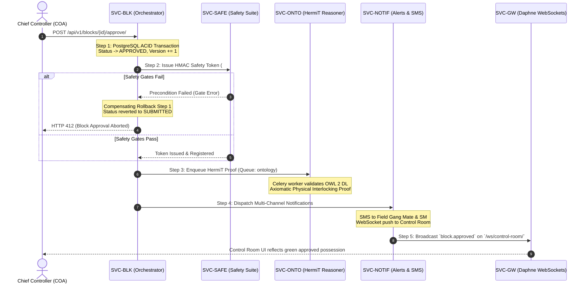

# 01-dependency-matrix.md

> **ফাইল ক্রম:** ১৫/৪৫  
> **পূর্ববর্তী ফাইল:** [02-microservices/00-service-index.md](file:///c:/work%20pase/Railway-Project-for-SIH/docs/02-microservices/00-service-index.md) (Master Service Catalog, 10 Bounded Contexts, PostGIS Schemas)  
> **পরবর্তী ফোল্ডার ও ফাইল:** [03-service-blueprints/00-service-template.md](file:///c:/work%20pase/Railway-Project-for-SIH/docs/03-service-blueprints/00-service-template.md)  
> **সংযোগ ও উদ্দেশ্য:** এই ফাইলে প্ল্যাটফর্মের ১০টি বাউন্ডেড সার্ভিসের মধ্যকার $10 \times 10$ ইন্টার-সার্ভিস ডিপেনডেন্সি ম্যাট্রিক্স, PostgreSQL 15 + PostGIS 3.3 মাইগ্রেশন ও কোল্ড-বুট সিকোয়েন্সিং (Phases 0-5), সার্কিট ব্রেকার্স ও ব্লাস্ট রেডিয়াস মিটিগেশন, এবং সেফটি-ক্রিটিক্যাল ৪-স্টেপ সাগা (SAGA) কম্পেনসেটিং ট্রানজাকশন বাউন্ডারি সংজ্ঞায়িত করা হয়েছে।

---

## 1. Inter-Service Dependency Matrix ($10 \times 10$)

The interaction between bounded contexts is strictly governed by Clean Architecture contracts. Direct inter-service coupling is minimized by categorizing communication into 4 distinct invocation patterns:
- **`—`**: Zero direct dependency (সম্পূর্ণ স্বাধীন ও আইসোলেটেড)।
- **`SYNC`**: In-process synchronous Python interface / read-only repository contract (`apps.core.contracts`).
- **`POSTGIS`**: Spatial database containment, proximity, or intersection evaluation (`ST_Intersects`, `ST_DWithin`).
- **`TASK`**: Asynchronous job dispatched to one of Celery's 4 priority queues (`high`, `notify`, `ontology`, `default`).
- **`EVENT`**: Real-time event emitted via Django Signal or Redis Channel Layer for Daphne WebSocket broadcast.

### Master $10 \times 10$ Dependency Matrix

| Calling Service (↓) \ Target (→) | SVC-AUTH | SVC-BLK | SVC-TRN | SVC-AST | SVC-DEPT | SVC-ONTO | SVC-SAFE | SVC-NOTIF | SVC-ANA | SVC-GW |
|---|:---:|:---:|:---:|:---:|:---:|:---:|:---:|:---:|:---:|:---:|
| **SVC-AUTH** (`accounts`) | — | — | — | — | SYNC (Dept Code)| — | SYNC (Role) | — | EVENT (Audit) | — |
| **SVC-BLK** (`blocks`) | SYNC (Auth) | — | SYNC+POSTGIS (Sec) | SYNC (Ast) | SYNC (Gang) | TASK (`ontology`) | SYNC+TASK (Gates) | TASK (`notify`) | EVENT (Audit) | EVENT (WS) |
| **SVC-TRN** (`trains`) | SYNC (Auth) | SYNC (Active) | — | POSTGIS (GIS) | — | — | — | TASK (`notify`) | EVENT (Audit) | EVENT (WS) |
| **SVC-AST** (`assets`) | SYNC (Auth) | TASK (Defect) | POSTGIS (Sec) | — | — | TASK (`ontology`) | — | TASK (`notify`) | EVENT (Audit) | — |
| **SVC-DEPT** (`departments`)| SYNC (Auth) | — | — | — | — | — | SYNC (Crew) | — | EVENT (Audit) | — |
| **SVC-ONTO** (`ontology`)| — | SYNC (Read) | SYNC (Route) | SYNC (Asset) | — | — | SYNC (Rules) | — | EVENT (Done) | EVENT (WS) |
| **SVC-SAFE** (`emergency`)| SYNC (Auth) | SYNC (Block) | SYNC (Clear) | — | SYNC (Crew) | SYNC (Proof) | — | TASK (`notify`) | EVENT (Audit) | EVENT (WS) |
| **SVC-NOTIF** (`notifications`)| SYNC (Phone)| SYNC (Read) | — | — | — | — | — | — | EVENT (Audit) | EVENT (WS) |
| **SVC-ANA** (`analytics`)| SYNC (Read) | SYNC (Read) | SYNC (Read) | SYNC (Read) | SYNC (Read) | SYNC (Read) | SYNC (Read) | SYNC (Read) | — | — |
| **SVC-GW** (`frontend`/Nginx)| REST | REST+WS | REST | REST | REST | REST | REST | REST+WS | REST | — |

---

## 2. Phased Cold-Boot & Initialization Sequence

To prevent race conditions, circular locking, and database connection deadlocks during system startup, services initialize across 6 strictly ordered phases:

```
[Phase 0: Core Infrastructure & Storage Engine]
  │  1. PostgreSQL 15 + PostGIS 3.3 (Port 5432) ──► Executes `scripts/init_postgres.sh`
  │  2. Redis 7 Broker (Port 6379)              ──► Appends AOF log, readies DB 0-3
  ▼
[Phase 1: Foundational Masters & Identity]
  │  3. SVC-DEPT (`departments` app)            ──► Initializes department codes (ENGG, TRD, SNT, OPTG)
  │  4. SVC-AUTH (`accounts` app)               ──► Generates superadmin, loads Spatial Jurisdictions
  ▼
[Phase 2: Network Topology & Asset Digital Twin]
  │  5. SVC-TRN (`trains` app)                  ──► Loads PostGIS track LineStrings, sections, stations
  │  6. SVC-AST (`assets` app)                  ──► Initializes track segments, points, OHE cantilever posts
  ▼
[Phase 3: Domain Safety & Planning Engines]
  │  7. SVC-SAFE (`emergency` app)              ──► Bootstraps 15 safety gates, HMAC token seeds (#71-85)
  │  8. SVC-BLK (`blocks` app)                  ──► Bootstraps spatial conflict engine & SAGA state machine
  ▼
[Phase 4: Symbolic AI Knowledge Graph]
  │  9. SVC-ONTO (`ontology` app)               ──► Loads `railway_digital_twin.owl`, inits HermiT Reasoner
  ▼
[Phase 5: Asynchronous Dispatchers & Client Edge]
  │ 10. Celery Workers (4 Queues)               ──► Connects `high`, `notify`, `ontology`, `default`
  │ 11. Celery Beat Periodic Scheduler          ──► Activates operational rollups & weather cron
  │ 12. Daphne ASGI WebSocket Server (:8001)    ──► Opens control room streaming channel
  │ 13. Gunicorn WSGI REST API Server (:8000)   ──► Binds HTTP routes & middleware pipeline
  │ 14. Nginx Reverse Proxy Edge (:80/:443)     ──► Opens client traffic to React 18 SPA
```

---

## 3. Database Migration Order (PostgreSQL 15 + PostGIS 3.3)

Foreign key constraints and PostGIS spatial dependencies require migrations to execute in strict linear succession:

```bash
# ==============================================================================
# Master PostgreSQL 15 + PostGIS 3.3 Migration Execution Sequence
# ==============================================================================

# 1. Base department lookup tables (no foreign keys)
python manage.py migrate departments

# 2. User credentials and spatial jurisdiction boundaries (FK -> departments)
python manage.py migrate accounts

# 3. Railway corridor topology with PostGIS LineStrings (independent spatial master)
python manage.py migrate trains

# 4. Physical railway assets tied to corridor track sections (FK -> trains)
python manage.py migrate assets

# 5. Departmental gangs, rosters, and specialized machinery (FK -> departments, trains)
python manage.py migrate departments

# 6. Safety suite tables: tokens, LOTO logs, PTW records (FK -> accounts)
python manage.py migrate emergency

# 7. Block possession requests, spatial conflicts, and SAGA state (FK -> accounts, trains, departments)
python manage.py migrate blocks

# 8. Semantic ontology sync records (FK -> blocks)
python manage.py migrate ontology

# 9. Multi-channel notification delivery logs (FK -> accounts, blocks)
python manage.py migrate notifications

# 10. Immutable audit log and KPI aggregators (FK -> accounts)
python manage.py migrate analytics
```

---

## 4. Circular Dependency Prevention Rules

To preserve clean architecture boundaries and prevent deadlocks across Python modules:

1. **Acyclic Dependency Principle (ADP)**:
   - Dependencies must flow strictly from domain-specific or edge services toward core infrastructure and foundational services.
   - Circular imports between Python apps (e.g., `from apps.blocks.models import Block` inside `apps.accounts.models`) are strictly prohibited and enforced via flake8/ruff linters.

2. **In-Process Contract Interfaces (`apps.core.contracts`)**:
   - When a service requires data owned by another bounded context, it must invoke a read-only repository contract rather than directly importing the foreign model.
   - Example: `apps.blocks` accesses train delays via `TrainScheduleContract.get_active_delays_for_corridor(corridor_id)`.

3. **Single Write Authority (SWA)**:
   - Each database table has exactly one owning bounded context. No service is permitted to execute `INSERT`, `UPDATE`, or `DELETE` on a table owned by another service.
   - Cross-domain modifications must be requested through explicit service methods or SAGA orchestration.

4. **Decoupled Asynchronous Events (Outbox Pattern)**:
   - State changes publish events to Redis (`DB 1`) or Celery queues (`DB 0`). The publishing service does not wait for or depend on downstream consumers.

---

## 5. Failure Cascade Analysis & Blast Radius Containment

The platform implements **PyBreaker 1.0** circuit breakers and graceful degradation fallbacks to ensure that failures in non-critical components never halt railway operations:

```
┌────────────────────────────────────────────────────────────────────────────────────────────────────────┐
│                                   FAILURE CONTAINMENT MATRIX                                           │
├──────────────┬──────────────────┬──────────────┬───────────────────────────────────────────────────────┤
│ Failed Unit  │ Impacted Feature │ Blast Radius │ Degradation Fallback & Recovery Mode                  │
├──────────────┼──────────────────┼──────────────┼───────────────────────────────────────────────────────┤
│ **SVC-ONTO** │ Semantic Digital │ LOW          │ Circuit breaker opens after 3 timeouts (30s). Blocks   │
│ (HermiT OOM  │ Twin Reasoning   │ (Semantic    │ continue approval via classical deterministic GIS     │
│  / Crash)    │ & Impact Proof   │  proof only) │ conflict engine. Background recovery restarts worker. │
├──────────────┼──────────────────┼──────────────┼───────────────────────────────────────────────────────┤
│ **SVC-NOTIF**│ SMS delivery to  │ LOW          │ Web UI WebSocket push remains functional. Failed SMS  │
│ (Twilio / SMS│ field gangs      │ (External SMS│ messages are routed to `dlq:notify:sms` in Redis DB 0 │
│  Gateway)    │                  │  channel)    │ with exponential backoff retry.                       │
├──────────────┼──────────────────┼──────────────┼───────────────────────────────────────────────────────┤
│ **Gemini AI**│ Bilingual Bengali│ LOW          │ Fallback instantly triggers hardcoded bilingual rule- │
│ (1.5 Flash   │ / Hindi card     │ (AI explain- │ based templates for "Why #1?" cards (#94). Controller │
│  Quota/503)  │ explanations     │  ability)    │ workflow is 100% uninterrupted.                       │
├──────────────┼──────────────────┼──────────────┼───────────────────────────────────────────────────────┤
│ **SVC-TRN**  │ Live GPS / NTES  │ MEDIUM       │ Conflict engine falls back to master scheduled working│
│ (Feed Loss)  │ train tracking   │ (Real-time   │ timetable (WTT) with conservative 15-min safety       │
│              │                  │  delays)     │ buffer margins.                                       │
├──────────────┼──────────────────┼──────────────┼───────────────────────────────────────────────────────┤
│ **SVC-AST**  │ Predictive asset │ LOW          │ Existing speed restrictions and block requests remain │
│ (Sensor Feed)│ health scoring   │ (Analytics)  │ cached in Redis. New inspections manually logged.      │
├──────────────┼──────────────────┼──────────────┼───────────────────────────────────────────────────────┤
│ **SVC-BLK**  │ Block planning & │ CRITICAL     │ System switches to Emergency Hot-Standby. Read-only   │
│ (Core DB /   │ conflict engine  │ (Operational │ dashboard displays current locked tracks. Manual paper │
│  Engine Fail)│                  │  workflow)   │ authority procedures activated per IR General Rules.  │
└──────────────┴──────────────────┴──────────────┴───────────────────────────────────────────────────────┘
```

---

## 6. Multi-Service Transaction Boundaries (SAGA Orchestration)

When a block possession is approved by the Chief Train Controller (COA), changes span 5 bounded contexts. The platform orchestrates this via an **Outbox-Backed Forward/Compensating SAGA**:



### SAGA Compensation Rules

1. **Local Atomic Commit**: Step 1 commits atomically in PostgreSQL. If the database transaction fails, no downstream messages are placed in the outbox.
2. **Safety Gate Abort**: If `SVC-SAFE` detects an active conflicting token or missing pre-requisite, the orchestrator executes compensating action `revert_block_approval()` which rolls back the block status and writes an audit event.
3. **Downstream Task Resilience**: If `SVC-ONTO` or `SVC-NOTIF` encounters a transient network failure, the SAGA does **not** rollback the physical track possession. The tasks are persisted in Redis Celery queues and automatically retried with exponential backoff.

---

## 7. Folder 02 Completion Summary & Handshake to Folder 03

With the completion of `01-dependency-matrix.md`, **Folder `02-microservices/` is 100% complete and verified**:

| File Index | Specification File | Status | Core Deliverables |
|:---:|---|:---:|---|
| **14** | `00-service-index.md` | ✅ Complete | Master Catalog of 10 Bounded Services, Schema Ownership (PostGIS), SLAs, Resource Ceilings |
| **15** | `01-dependency-matrix.md` | ✅ Complete | $10 \times 10$ Dependency Matrix, Phases 0-5 Boot Order, PostGIS Migrations, PyBreaker Fallbacks, SAGA Protocol |

---

### Handshake to Folder 03: Service Blueprints

> **পরবর্তী ফোল্ডার:** `03-service-blueprints/`  
> **পরবর্তী ফাইল:** `03-service-blueprints/00-service-template.md`

`03-service-blueprints/` ফোল্ডারে প্রতিটি বাউন্ডেড সার্ভিসের জন্য একটি পূর্ণাঙ্গ, প্রোডাকশন-রেডি আর্কিটেকচার ব্লুপ্রিন্ট তৈরি করা হবে:
- `00-service-template.md`: প্রতিটি সার্ভিসের স্ট্যান্ডার্ড আর্কিটেকচারাল ব্লুপ্রিন্ট টেমপ্লেট।
- `01-block-planning.md`: `SVC-BLK` (ব্লক প্ল্যানিং, কনফ্লিক্ট ইঞ্জিন, কম্বাইন্ড ব্লক উইন্ডো #98)।
- `02-train-traffic.md`: `SVC-TRN` (ট্রেন ট্রাফিক, পাঙ্কচুয়ালিটি লস, সেকশন ক্লিয়ারেন্স #80)।
- `03-asset-digital-twin.md`: `SVC-AST` ও `SVC-ONTO` (রেল অ্যাসেট, USFD ডিফেক্ট, HermiT Reasoner)।
- `04-safety-compliance.md`: `SVC-SAFE` (১৫টি সেফটি গেট #71–#85, ডিজিটাল টোকেন, LOTO, PTW)।
- `05-demo-data-system.md`: ডেমো ডেটা সিস্টেম (কোহেরেন্স ইঞ্জিন #117, সীড 26027 #118, অ্যাডাপ্টার সুইচ #121)।
- `06-analytics-reporting.md`: `SVC-ANA` ও `SVC-NOTIF` (অ্যানালিটিক্স, দ্বিভাষিক AI অনুবাদ #94, SMS)।
