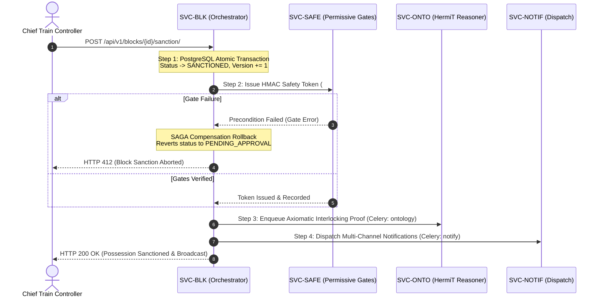

# 02-blocks.md

> **ফাইল ক্রম:** ১৮/৪৫  
> **পূর্ববর্তী ফাইল:** [03-service-blueprints/01-accounts.md](file:///c:/work%20pase/Railway-Project-for-SIH/docs/03-service-blueprints/01-accounts.md) (SVC-AUTH: Identity & Spatial RBAC Service)  
> **পরবর্তী ফাইল:** [03-service-blueprints/03-departments.md](file:///c:/work%20pase/Railway-Project-for-SIH/docs/03-service-blueprints/03-departments.md)  
> **সংযোগ ও উদ্দেশ্য:** এই ফাইলে প্ল্যাটফর্মের সবচেয়ে গুরুত্বপূর্ণ কোর ইঞ্জিন **`SVC-BLK` (Block Planning & Intelligent Conflict Detection Service)**-এর পূর্ণাঙ্গ প্রোডাকশন আর্কিটেকচার ব্লুপ্রিন্ট সংজ্ঞায়িত করা হয়েছে। এতে PostgreSQL 15 + PostGIS 3.3 স্পেশিয়াল ট্র্যাক লকিং (`ST_Intersects`), সুইপ-লাইন স্পেশিও-টেম্পোরাল কনফ্লিক্ট ইঞ্জিন, মাল্টি-ডিপার্টমেন্টাল কম্বাইন্ড ব্লক উইন্ডো (Feature #98), এবং ৪-স্টেপ সাগা (SAGA) অর্কেস্ট্রেশন বিস্তারিতভাবে নির্ধারিত হয়েছে।

---

# SVC-BLK: Block Planning & Intelligent Conflict Detection Service

> **Service ID:** `SVC-BLK`  
> **Bounded Context App:** `apps.blocks`  
> **Owning Team:** Train Operations & Traffic Planning Engineering Team  
> **Business Criticality:** `Safety-Critical (SIL-2 equivalent - Rail Traffic & Possession Infrastructure)`  
> **Primary SLA:** Availability $\ge 99.99\%$, p95 REST Latency $< 85\text{ ms}$, p95 Conflict Sweep $< 150\text{ ms}$  
> **Execution Runtime:** Gunicorn WSGI (:8000) + Daphne ASGI (:8001) + Celery 5.3 High Priority Queue (`high`)

---

## 1. Domain & Bounded Context Boundary

### 1.1 Core Business Mission & Railway Mandate
`SVC-BLK` হলো প্ল্যাটফর্মের সেন্ট্রাল অপারেশনাল ব্রেন। এটি ভারতীয় রেলওয়ের বিভিন্ন বিভাগ (ইঞ্জিনিয়ারিং/ENGG, ট্র্যাকশন ডিস্ট্রিবিউশন/TRD, এবং সিগন্যাল ও টেলিকম/S&T) থেকে আসা ট্র্যাক পজেশন ব্লক রিকোয়েস্টের লাইফসাইকেল, স্বয়ংক্রিয় স্পেশিও-টেম্পোরাল কনফ্লিক্ট ডিটেকশন, এবং **মাল্টি-ডিপার্টমেন্টাল কম্বাইন্ড ব্লক উইন্ডো (Combined Block Window - Feature #98)** পরিচালনা করে। 

PostgreSQL 15 + PostGIS 3.3 স্পেশিয়াল জিওমেট্রি (`LineString`, SRID 4326) এবং সুইপ-লাইন ইন্টারভাল-ট্রি অ্যালগরিদম প্রয়োগের মাধ্যমে এটি নিশ্চিত করে যে কোনো রক্ষণাবেক্ষণ ব্লকের কারণে প্যাসেঞ্জার ট্রেন (যেমন রাজধানী/শতাব্দী) কিংবা বিপরীতমুখী ট্রেনের সাথে কোনো শারীরিক বা সময়গত সংঘর্ষ (Collisions) না ঘটে।

- **Problem Statement PS26027 Alignment:**
  - [x] Pillar 1: Automated AI Conflict Detection & Deconfliction (100% collision-free track allocation)
  - [x] Pillar 2: Joint Inter-Departmental Combined Block Windows (Feature #98: Co-possession shadow blocks)
  - [x] Pillar 3: Permissive Safety & Site Execution Compliance (4-step SAGA sanction & digital handback)
  - [x] Pillar 4: Predictive Asset Twin & Minimum Operational Disruption (Headway buffer optimization)

### 1.2 Bounded Context Inclusions & Exclusions
- **In-Scope Responsibilities:**
  - Maintenance block proposal submission, validation, spatial extent verification, and state transitions.
  - Mathematical spatial-temporal conflict detection against live train schedules (`SVC-TRN`) and parallel maintenance blocks.
  - **Combined Block Windows (#98):** Automatic clustering and shadow-pairing of coincident ENGG, TRD, and S&T requests over identical track spans.
  - Track possession distributed locking via Redis (`lock:track:*`).
  - 4-step forward and compensating SAGA orchestrator for block sanctioning.
- **Explicit Exclusions (Out of Scope):**
  - Departmental crew gang rosters and track machine dispatch (delegated to `SVC-DEPT`).
  - Semantic OWL 2 DL axiomatic proofs (delegated to `SVC-ONTO`).
  - Live train timetabling and passenger delay calculations (delegated to `SVC-TRN`).
  - 15 Permissive safety gate physical sensor inputs (delegated to `SVC-SAFE`).

---

## 2. Technical Stack & Runtime Topology

```
┌────────────────────────────────────────────────────────────────────────────────────────────────────────┐
│                                    SVC-BLK RUNTIME ARCHITECTURE                                        │
├────────────────────────────────────────────────────────────────────────────────────────────────────────┤
│  Inbound Traffic: REST API (/api/v1/blocks/*) via Gunicorn (:8000) & WebSockets via Daphne (:8001)     │
│  Framework: Django 5.0 + Django REST Framework 3.15                                                    │
│  Spatial GIS Engine: PostgreSQL 15 + PostGIS 3.3 (Functions: ST_Intersects, ST_DWithin, ST_Buffer)    │
│  Conflict Engine: Sweep-Line Algorithm + Interval Tree (apps.blocks.conflict_engine)                   │
│  Asynchronous Execution: Celery 5.3 Worker on Queue: `high` (worker_high, Concurrency: 4)              │
│  Distributed Locks: Redis 7.2 (DB 2) - Track segment locks & GeoJSON corridor cache                    │
│  SAGA Orchestrator: Transactional Outbox + Event Bus State Machine                                    │
└────────────────────────────────────────────────────────────────────────────────────────────────────────┘
```

| Component | Technology | Version | Purpose & Railway Domain Justification |
|---|---|---|---|
| **Web Framework** | Django / DRF | 5.0.x / 3.15.x | Transactional atomic operations with `select_for_update` row-level locks |
| **Spatial Engine** | PostGIS | 3.3.x | Native `GiST` spatial indexing on 3D/2D track LineStrings with sub-10ms queries |
| **Conflict Solver** | Python IntervalTree | 3.1.0 | Sub-millisecond $O(\log n + k)$ interval intersection evaluation |
| **Task Queue** | Celery | 5.3.6 | Dedicated `high` priority queue with zero eviction for safety-critical tasks |
| **Channel Layer** | Redis 7 | 7.2.4 | Real-time push of block approvals and live Gantt chart invalidations |

---

## 3. Database Schema & Persistence (PostgreSQL 15 + PostGIS 3.3)

### 3.1 Table Definitions & Data Dictionary

```sql
-- =============================================================================
-- SVC-BLK PostgreSQL 15 + PostGIS 3.3 DDL Specification
-- =============================================================================

-- 1. Railway Track Corridor Infrastructure Master
CREATE TABLE blocks_corridor (
    id UUID PRIMARY KEY DEFAULT gen_random_uuid(),
    code VARCHAR(50) NOT NULL UNIQUE,
    name VARCHAR(150) NOT NULL,
    zone VARCHAR(10) NOT NULL DEFAULT 'ER',
    division VARCHAR(10) NOT NULL DEFAULT 'HWH',
    source_station VARCHAR(50) NOT NULL DEFAULT 'HWH',
    destination_station VARCHAR(50) NOT NULL DEFAULT 'BWN',
    start_km NUMERIC(8, 3) NOT NULL DEFAULT 0.000,
    end_km NUMERIC(8, 3) NOT NULL DEFAULT 95.000,
    
    -- PostGIS Track Centerline Geometry (SRID 4326 WGS-84)
    track_geometry GEOMETRY(LineString, 4326) NOT NULL,
    
    is_electrified BOOLEAN NOT NULL DEFAULT TRUE,
    max_permissible_speed_kmh INT NOT NULL DEFAULT 130,
    created_at TIMESTAMPTZ NOT NULL DEFAULT CURRENT_TIMESTAMP
);

-- 2. Maintenance Block Possession Requests & State Machine
CREATE TABLE blocks_block (
    id UUID PRIMARY KEY DEFAULT gen_random_uuid(),
    block_code VARCHAR(50) NOT NULL UNIQUE,
    corridor_id UUID NOT NULL,
    line_type VARCHAR(20) NOT NULL DEFAULT 'DOWN',
    
    -- Requesting Department & Operational Metadata
    department_code VARCHAR(20) NOT NULL DEFAULT 'ENG',
    work_type VARCHAR(40) NOT NULL DEFAULT 'TRACK_TAMPING',
    requested_by_id INT NULL,
    gang_id VARCHAR(50) NOT NULL DEFAULT '',
    equipment_required VARCHAR(150) NOT NULL DEFAULT '',
    
    -- Spatial Span Along Corridor
    start_km NUMERIC(8, 3) NOT NULL CHECK (start_km >= 0),
    end_km NUMERIC(8, 3) NOT NULL CHECK (end_km > start_km),
    
    -- PostGIS Exact Possession Span LineString
    spatial_extent GEOMETRY(LineString, 4326) NOT NULL,
    
    -- Scheduled Temporal Possession Window
    scheduled_start_time TIMESTAMPTZ NOT NULL,
    scheduled_end_time TIMESTAMPTZ NOT NULL,
    
    -- Actual Realized Window (Filled post-commence/clear)
    actual_start_time TIMESTAMPTZ NULL,
    actual_end_time TIMESTAMPTZ NULL,
    
    -- Traction Power Isolation
    traction_power_cutoff_required BOOLEAN NOT NULL DEFAULT FALSE,
    
    -- State Machine & Approval Governance
    status VARCHAR(30) NOT NULL DEFAULT 'PENDING_APPROVAL',
    rejection_reason TEXT NULL,
    sanctioned_by_id INT NULL,
    sanctioned_at TIMESTAMPTZ NULL,
    caution_order_id VARCHAR(50) NOT NULL DEFAULT '',
    track_fit_certified BOOLEAN NOT NULL DEFAULT FALSE,
    
    -- Feature #98: Combined Shadow-Block Pairing
    parent_block_id UUID NULL,
    is_shadow BOOLEAN NOT NULL DEFAULT FALSE,
    
    -- Optimistic Concurrency Control
    version INT NOT NULL DEFAULT 1,
    
    work_description TEXT NOT NULL DEFAULT '',
    created_at TIMESTAMPTZ NOT NULL DEFAULT CURRENT_TIMESTAMP,
    updated_at TIMESTAMPTZ NOT NULL DEFAULT CURRENT_TIMESTAMP,
    
    -- Foreign Keys
    CONSTRAINT fk_blocks_corridor FOREIGN KEY (corridor_id) 
        REFERENCES blocks_corridor(id) ON DELETE RESTRICT,
    CONSTRAINT fk_blocks_parent FOREIGN KEY (parent_block_id) 
        REFERENCES blocks_block(id) ON DELETE SET NULL,
        
    -- Check Constraints
    CONSTRAINT chk_blocks_status CHECK (
        status IN ('DRAFT', 'PENDING_APPROVAL', 'COORDINATED', 'CONFLICT_DETECTED', 
                   'SANCTIONED', 'ACTIVE', 'COMPLETED', 'CANCELLED', 'REJECTED')
    ),
    CONSTRAINT chk_blocks_line_type CHECK (
        line_type IN ('UP', 'DOWN', 'BIDIRECTIONAL', 'LOOP_1', 'LOOP_2', 'YARD')
    )
);

-- 3. Persisted Block Conflict Ledger
CREATE TABLE blocks_blockconflict (
    id UUID PRIMARY KEY DEFAULT gen_random_uuid(),
    block_id UUID NOT NULL,
    conflict_type VARCHAR(40) NOT NULL DEFAULT 'PARALLEL_BLOCK_COLLISION',
    severity VARCHAR(20) NOT NULL DEFAULT 'HIGH',
    
    -- Conflicting Entity (Another Block Code or Train Number)
    conflicting_entity_id VARCHAR(64) NOT NULL,
    conflicting_entity_label VARCHAR(150) NOT NULL DEFAULT '',
    
    -- Overlap Window
    overlap_start_km NUMERIC(8, 3) NOT NULL,
    overlap_end_km NUMERIC(8, 3) NOT NULL,
    conflict_start_time TIMESTAMPTZ NOT NULL,
    conflict_end_time TIMESTAMPTZ NOT NULL,
    
    -- Resolution State
    resolution_status VARCHAR(30) NOT NULL DEFAULT 'UNRESOLVED',
    resolution_notes TEXT NOT NULL DEFAULT '',
    created_at TIMESTAMPTZ NOT NULL DEFAULT CURRENT_TIMESTAMP,
    
    CONSTRAINT fk_conflicts_block FOREIGN KEY (block_id) 
        REFERENCES blocks_block(id) ON DELETE CASCADE,
    CONSTRAINT chk_conflicts_severity CHECK (
        severity IN ('CRITICAL', 'HIGH', 'MEDIUM', 'LOW')
    ),
    CONSTRAINT chk_conflicts_resolution CHECK (
        resolution_status IN ('UNRESOLVED', 'AUTO_RESOLVED', 'SHADOW_MERGED', 
                              'MANUALLY_OVERRIDDEN', 'DISMISSED')
    )
);
```

### 3.2 PostGIS Spatial & Composite Indexing
```sql
-- GiST Spatial Indexing for Corridors and Block Possession Spans
CREATE INDEX idx_blocks_corridor_geom ON blocks_corridor USING GIST (track_geometry);
CREATE INDEX idx_blocks_block_spatial_extent ON blocks_block USING GIST (spatial_extent);

-- Composite B-tree Indexes for High-Frequency Operational Queries
CREATE INDEX idx_blocks_corridor_time ON blocks_block (corridor_id, scheduled_start_time, scheduled_end_time);
CREATE INDEX idx_blocks_status_dept ON blocks_block (status, department_code);
CREATE INDEX idx_conflicts_block_res ON blocks_blockconflict (block_id, resolution_status);
```

### 3.3 Redis Caching & Distributed Mutex Strategy
- **Distributed Mutex Lock:** `lock:track:{corridor_id}:{start_km}_{end_km}` with TTL = 10s. Acquired during block sanctioning to prevent race conditions.
- **Active Possessions Cache:** `cache:blocks:active:{corridor_id}` -> GeoJSON collection of currently live blocks (TTL = 60s, invalidated on block state transition).
- **Conflict Summary Cache:** `cache:blocks:conflicts:{block_id}` -> Instant response for dashboard badges.

---

## 4. API Endpoints Specification

All endpoints conform to the standard platform JSON envelope:
```json
{
  "success": true,
  "data": { ... },
  "error": null,
  "timestamp": "2026-09-18T10:20:00.000Z",
  "correlation_id": "b35975f5-cc5c-4d55-90cf-e0e124b2c600"
}
```

### Master API Routing Contract

| Method | Endpoint Route | Auth & RBAC | Request DTO | Response DTO | SLA Target |
|---|---|---|---|---|:---:|
| `POST` | `/api/v1/blocks/proposals/` | `DEPT_ENGINEER` | Proposed Block Creation JSON | Created Block DTO + Detected Conflicts | p95 < 120ms |
| `GET` | `/api/v1/blocks/` | Authenticated | Filters: `corridor`, `status`, `time` | Paginated Block Envelope List | p95 < 75ms |
| `GET` | `/api/v1/blocks/{id}/` | Authenticated | URL UUID Parameter | Block Detail DTO with Conflicts & Gang | p95 < 40ms |
| `POST` | `/api/v1/blocks/{id}/validate/` | Authenticated | Empty | Conflict Evaluation Report | p95 < 150ms |
| `POST` | `/api/v1/blocks/{id}/sanction/` | `CHIEF_CONTROLLER` (COA)| `{"remarks": "Sanctioned"}` | SAGA Result DTO (`status: SANCTIONED`)| p95 < 90ms |
| `POST` | `/api/v1/blocks/{id}/commence/` | `DEPT_ENGINEER` | Safety Gate Checklist (5 Gates) | Updated Block DTO (`status: ACTIVE`) | p95 < 80ms |
| `POST` | `/api/v1/blocks/{id}/clear/` | `SITE_SUPERVISOR`| `{"track_fit_certified": true}` | Updated Block DTO (`status: COMPLETED`)| p95 < 80ms |
| `GET` | `/api/v1/blocks/conflicts/` | Authenticated | Filter: `unresolved=true` | Master Conflict Collision Matrix | p95 < 60ms |

---

## 5. Event-Driven Contracts & Channels Protocol

### 5.1 Published Events (Redis Outbox & Daphne WebSocket)

```json
{
  "event_id": "d8213e4b-9721-4fce-bc81-c3008915e478",
  "event_type": "blocks.possession.sanctioned",
  "timestamp": "2026-09-18T10:25:00.000000Z",
  "actor_id": "COA-SHARMA-1001",
  "payload": {
    "block_id": "550e8400-e29b-41d4-a716-446655440000",
    "block_code": "BLK-20260918-ENG-001",
    "corridor_code": "HWH-BWN-CHORD",
    "line_type": "DOWN",
    "start_km": 24.500,
    "end_km": 28.200,
    "scheduled_start_time": "2026-09-19T02:00:00Z",
    "scheduled_end_time": "2026-09-19T06:00:00Z",
    "traction_cutoff": true,
    "departments_involved": ["ENG", "TRD"],
    "is_shadow": false
  }
}
```

### 5.2 Real-Time Control Room WebSocket Stream
- **Endpoint:** `ws://[host]:8001/ws/control-room/`
- **Group:** `control_room_HWH`
- **Action Trigger:** Sanction, activation, or conflict occurrence automatically triggers a non-blocking WebSocket broadcast updating the Gantt timeline on all active control desks without page refresh.

---

## 6. Mathematical Conflict Detection & Combined Block Windows (Feature #98)

### 6.1 Sweep-Line Conflict Detection Algorithm
The `ConflictDetector` engine executes a 3-dimensional evaluation:
$$\text{Spatial Check: } \text{ST\_DWithin}(\text{Block}_{\text{extent}}, \text{Train}_{\text{extent}}, 1.5\text{ km}) = \text{TRUE}$$
$$\text{Temporal Check: } [\text{Start}_{\text{block}} - 15\text{ min}, \text{End}_{\text{block}} + 15\text{ min}] \cap [\text{Start}_{\text{train}}, \text{End}_{\text{train}}] \neq \emptyset$$

```
┌────────────────────────────────────────────────────────────────────────────────────────────────────────┐
│                                 SPATIAL-TEMPORAL CONFLICT PIPELINE                                     │
├────────────────────────────────────────────────────────────────────────────────────────────────────────┤
│ 1. PostGIS Spatial Filter: Query blocks/paths where ST_Intersects(block.spatial_extent, target.geom)   │
│ 2. Temporal Interval Sweep: Compare scheduled window against 15-minute headway buffer                  │
│ 3. Severity Classification:                                                                            │
│    ├── If conflicting with RAJDHANI / SHATABDI / VANDE BHARAT ──► CRITICAL Severity (Zero Tolerance)   │
│    ├── If conflicting with PARALLEL BLOCK on SAME LINE       ──► CRITICAL Overlap                      │
│    ├── If conflicting with FREIGHT TRAIN                      ──► MEDIUM Severity (Eligible for Reroute)│
│    └── If coincident across DEPARTMENTS (ENG + TRD + S&T)     ──► SHADOW_MERGED (Feature #98)           │
│ 4. Persist conflict ledger records and update Block status to CONFLICT_DETECTED or COORDINATED         │
└────────────────────────────────────────────────────────────────────────────────────────────────────────┘
```

### 6.2 Feature #98: Combined Block Window Optimization (USP)
When Engineering (ENGG) schedules a track tamping block on KM 25.0 to 28.0 from 02:00 to 06:00, the platform automatically scans for pending TRD (OHE inspection) and S&T (Point overhaul) proposals along the same spatial corridor:
- **Shadow Merging:** TRD and S&T requests are converted to `is_shadow = TRUE` linked to `parent_block_id`.
- **Possession Multiplier:** Rather than shutting down the line three times for a total of 12 hours, a single 4-hour window accommodates all 3 departments, saving **8 hours of train downtime**.

### 6.3 PriorityScorer (Expert System Layer)
অমীমাংসিত দ্বন্দ্বের ক্ষেত্রে (Unresolved Conflicts), `PriorityScorer` একটি মাল্টি-ফ্যাক্টর হিউরিস্টিক ইঞ্জিন ব্যবহার করে প্রতিটি ব্লক এবং ট্রেনের জন্য একটি প্রায়োরিটি স্কোর (০-১০০) গণনা করে:
- **Department Base:** ENG (30) > TRD (25) > SNT (20).
- **Work Type Impact:** Track Tamping (25), Rail Renewal (30), etc.
- **Urgency Context:** Emergency/Fracture (+40) vs Routine (+5).
- **Train Prestige:** Vande Bharat/Rajdhani (100) > Express (75) > Freight (40).

### 6.4 ResolutionEngine (Expert System Layer - Strategy Pattern)
`ConflictDetector` দ্বারা চিহ্নিত দ্বন্দ্বগুলো `ResolutionEngine`-এ প্রবেশ করে। এটি ৪টি স্বয়ংক্রিয় রেজোলিউশন স্ট্র্যাটেজি প্রয়োগ করে:
1. **CoPossessionStrategy:** Compatible কাজের ক্ষেত্রে শ্যাডো-ব্লক (Shadow-Block) তৈরি করে (Feature #98)।
2. **TimeSplitStrategy:** উচ্চ-অগ্রাধিকার সম্পন্ন ট্রেনের (যেমন বন্দে ভারত) যাতায়াতের জন্য ব্লকের সময়কে দ্বিখণ্ডিত করে।
3. **DiversionStrategy:** ব্লকের স্কোর বেশি হলে, মালগাড়ি (Freight) বা কম-অগ্রাধিকারের ট্রেনকে লুপ লাইনে ডাইভার্ট করে।
4. **RescheduleStrategy:** অন্যান্য বিকল্প ব্যর্থ হলে, ব্লকের সময় পরিবর্তন করে (+৪ ঘণ্টা শিফট করে)।

---

## 7. SAGA Orchestrator & Optimistic Concurrency Control

### 7.1 Forward Execution Workflow (COA Sanction)


### 7.2 Optimistic Concurrency Protection
To eliminate race conditions between concurrent controllers:
```python
with transaction.atomic():
    block = Block.objects.select_for_update().get(id=block_id)
    if block.version != request_version:
        raise ConcurrencyConflictError("Block was updated by another controller. Please refresh.")
    block.status = BlockStatus.SANCTIONED
    block.version += 1
    block.save()
```

---

## 8. Configuration & Environment Variables

```env
# ==============================================================================
# SVC-BLK Operational Configuration
# ==============================================================================
BLOCKS_SAFETY_BUFFER_KM=1.5
BLOCKS_HEADWAY_BUFFER_MINUTES=15
BLOCKS_MAX_SPAN_KM=25.0
BLOCKS_DEFAULT_CORRIDOR=HWH-BWN-CHORD

# SAGA & Celery Execution
BLOCKS_CELERY_QUEUE=high
BLOCKS_SAGA_TIMEOUT_SECONDS=30
BLOCKS_DISTRIBUTED_LOCK_TIMEOUT_SECONDS=10
```

---

## 9. Observability & Health Probes

- **Liveness Probe:** `GET /api/v1/blocks/health/liveness/` -> Returns `200 OK {"status": "UP"}`.
- **Readiness Probe:** `GET /api/v1/blocks/health/readiness/` -> Validates PostGIS spatial query responsiveness (`ST_MakePoint`) and Redis DB 2 connectivity.
- **Prometheus Custom Metrics:**
  - `blocks_conflict_detection_duration_seconds` (Histogram, p50/p95/p99)
  - `blocks_active_total{corridor, line_type}` (Gauge)
  - `blocks_shadow_merged_total{department}` (Counter - Feature #98 metrics)
  - `blocks_sanction_saga_rollbacks_total` (Counter)

---

## 10. Testing & Quality Assurance Mandate

- **Conflict Engine Unit Tests (`tests/test_conflict_engine.py`):** 100% strict branch coverage verifying all 4 conflict types and shadow block merging logic.
- **PostGIS Spatial Intersect Tests (`tests/test_spatial_blocks.py`):** Verify `ST_Intersects` correctly flags track possession collisions and respects non-fouling parallel lines.
- **Concurrent Modification Test:** Verify that two simultaneous controllers attempting to approve the same block result in exactly one success and one concurrency exception.
- **SAGA Rollback Test:** Verify that a failure in `SVC-SAFE` token generation atomically rolls back the block sanction.

---

## 11. Next File Dependency Note

> **পরবর্তী ফাইল:** [03-service-blueprints/03-departments.md](file:///c:/work%20pase/Railway-Project-for-SIH/docs/03-service-blueprints/03-departments.md)

`02-blocks.md` (`SVC-BLK`) সম্পূর্ণ প্রস্তুত। পরবর্তী ফাইল `03-departments.md`-এ **Department & Resource Management Service (`SVC-DEPT`)**-এর প্রোডাকশন ব্লুপ্রিন্ট (ইঞ্জিনিয়ারিং, ট্র্যাকশন ও সিগন্যাল গ্যাং ক্রু, BCM/TTM হেভি ট্র্যাক মেশিন এবং স্পেয়ার পার্টস ইনভেন্টরি) সংজ্ঞায়িত করা হবে।
