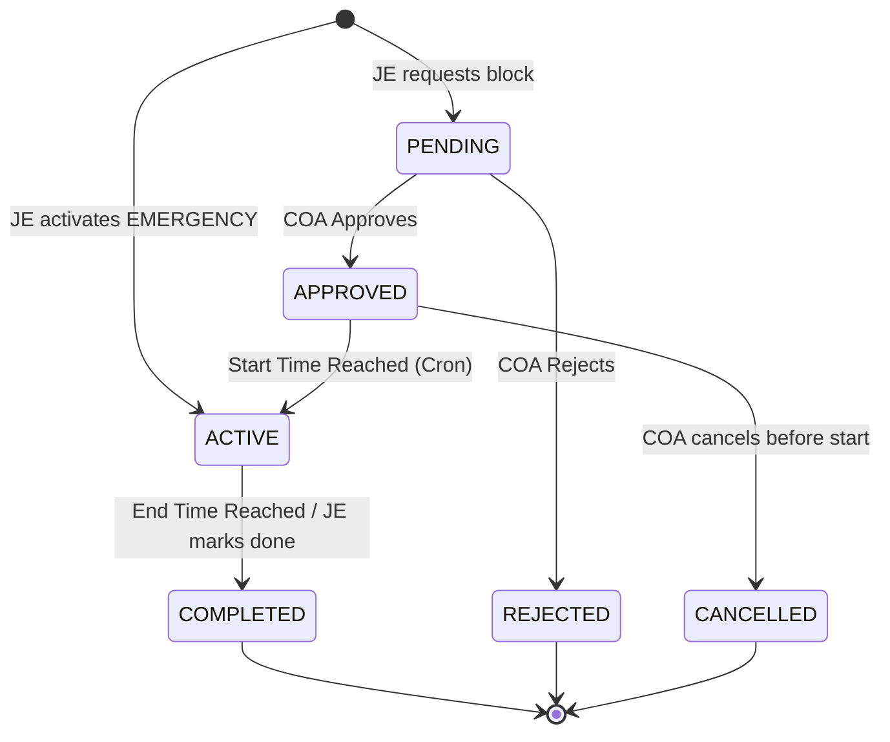

# 03-state-management.md

> **File Order:** 29/45  
> **Previous File:** `05-deep-dive-logs/02-error-code-registry.md`  
> **Next File:** `05-deep-dive-logs/04-bug-log-template.md`  

---

## 1. Backend State Machine (Block Lifecycle)

The `BlockRequest` model transitions through strict states.



**State Enforcement:**
- A `PENDING` block cannot be transitioned directly to `COMPLETED`.
- Only `APPROVED` or `ACTIVE` blocks are synced to the Ontology graph.
- An `ACTIVE` block locks the assigned `Crew` making them unavailable.

---

## 2. Frontend State Management (Zustand)

The React frontend uses Zustand for global state management to avoid prop-drilling.

### 2.1 Store Layout

We split the global state into logical slices.

| Store | Purpose | Key Variables |
|-------|---------|---------------|
| `useAuthStore` | User identity & JWT | `user`, `accessToken`, `isAuthenticated` |
| `useBlockStore` | Caching blocks for map | `pendingBlocks`, `activeBlocks`, `selectedBlockId` |
| `useMapStore` | Mapbox viewport state | `viewport`, `layersVisible` |
| `useAlertStore` | WebSocket messages | `notifications`, `unreadCount` |

### 2.2 Example: `useBlockStore.js`

```javascript
import { create } from 'zustand';
import api from '../utils/api';

const useBlockStore = create((set, get) => ({
  pendingBlocks: [],
  activeBlocks: [],
  isLoading: false,
  error: null,

  fetchPendingBlocks: async () => {
    set({ isLoading: true });
    try {
      const response = await api.get('/blocks/pending/');
      set({ pendingBlocks: response.data.results, isLoading: false, error: null });
    } catch (error) {
      set({ error: error.response?.data?.message, isLoading: false });
    }
  },

  // Called via WebSocket when a block is approved by COA
  removePendingBlock: (blockId) => {
    set((state) => ({
      pendingBlocks: state.pendingBlocks.filter(b => b.id !== blockId)
    }));
  }
}));

export default useBlockStore;
```
